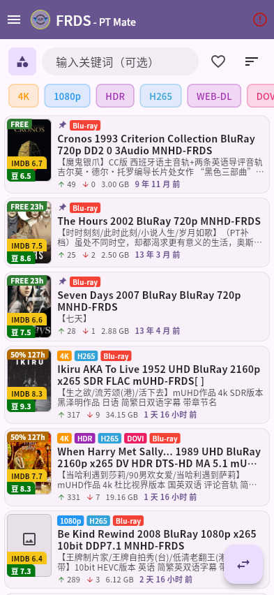
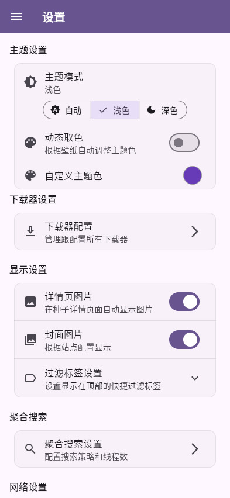

# PT Mate

[简体中文](./README.zh-CN.md)

A Flutter-based private tracker client built with Material Design 3. PT Mate supports torrent browsing, search, and download management across multiple PT site types.

📣 Official Telegram group: [Join the PT Mate community](https://t.me/pt_mate)

## Features

- Browse torrents, search, view details, favorite items, and perform bulk actions
- Aggregated search across multiple sites
- Downloader integration (`qBittorrent` / `Transmission`)
- Local relay download support
- Backup and restore, including WebDAV
- Cookie Cloud synchronization and batch configuration

## Supported Site Types

- `Gazelle`
- `M-Team`
- `NexusPHP`
- `NexusPHPWeb`
- `RousiPro`
- `Unit3D`

## Supported Sites

The following list is based on `assets/sites/*.json` (37 total):

- `Gazelle` (1): DIC Music
- `M-Team` (1): M-Team
- `NexusPHP` (13): 藏宝阁, 天枢, 自由农场, 好学, 垃圾堆, 幸运, momentpt, PTFans, PT GTK, PTSKit, PTZone, 肉丝, 织梦
- `NexusPHPWeb` (20): AFUN, 末日, Audiences, 比特校园, 财神, FRDS, HDDolby, HDFans, 麒麟, HHanClub, 老师, OurBits, ptt, 青蛙, SSD, TTG, U2Share, UBits, 星陨阁, 猪猪
- `RousiPro` (1): 肉丝Pro(beta)
- `Unit3D` (1): MonikaDesign

## Screenshots

<p align="center">
  
  
  
</p>

## Cookie Cloud Sync & Critical Security Warning

PT Mate now supports **Cookie Cloud** integration, allowing you to synchronize logged-in PT site cookies from your desktop browser to PT Mate on your mobile device. This avoids tedious manual cookie copying and supports batch site import/update based on site presets.

> [!CAUTION]
> ### ⚠️ CRITICAL SECURITY & ACCOUNT BAN WARNING (PLEASE READ CAREFULLY!)
>
> Cookies are your unique **identity credentials** on PT sites. Leaking them gives absolute control over your accounts to others. Before enabling this feature, you must fully understand and accept the following severe risks:
>
> 1. **NEVER Use Untrusted Public Cookie Cloud Servers**
>    - Server operators or attackers can easily intercept your cookies through server logs or vault database vulnerabilities.
>    - **Highly Recommended**: ONLY use a private, self-hosted Cookie Cloud server instance (e.g., deployed via Docker on your own NAS, VPS, or private network).
> 2. **Severe Account Ban Risks (Multi-IP & Session Hijacking Detection)**
>    - Many Private Tracker (PT) sites enforce extremely strict security rules against simultaneous access from multiple IPs or rapid geographical relocation (e.g., cellular data vs. home broadband).
>    - If PT Mate makes requests using synced cookies over mobile networks (4G/5G/LTE) while your desktop browser is still active on home broadband, the site's security monitors might flag this as **"account sharing" or "session hijacking," resulting in an immediate and permanent account ban**.
>    - **Recommendation**: Exercise extreme caution when using PT Mate on cellular/public networks. Disable auto-sync or refresh for highly sensitive sites when not connected to your home network, or configure appropriate proxies.
> 3. **Encryption is Not Invulnerable**
>    - Although Cookie Cloud uses client-side encryption (AES via key derivation from UUID and password), weak UUIDs or short passwords can still be brute-forced. Always use strong, complex sync credentials.
> 4. **Exceeded Scope Risk (Not Limited to PT Sites)**
>    - By default, browser Cookie Cloud extensions will **synchronize all website cookies in your browser** (including your emails, banking, shopping, and social media sites).
>    - **Security Recommendation**: Configure domain whitelist/blacklist rules in your browser extension to restrict sync strictly to PT sites, avoiding leakage of non-PT high-value sessions.
> 5. **Operating System Constraints & Plaintext Storage Risk**
>    - While the application utilizes platform secure storage pipelines (Keychain/KeyStore), on certain Linux distributions or environments lacking a proper keyring service, the app may fall back to **storing Cookie Cloud credentials in plaintext** within configuration files.
> 6. **Backup Exports & WebDAV Sync Exposures**
>    - The exported backup files and the cloud-synced WebDAV backup payloads **contain the full, unencrypted Cookie Cloud configuration**.
>    - **Security Recommendation**: Store exported backup JSON files securely. Ensure your WebDAV connection **strictly uses the HTTPS protocol** (never HTTP) to prevent man-in-the-middle sniffing of backup data.
> 7. **Runtime Memory Snooping Risk**
>    - At runtime, the application necessarily holds plaintext cookies and credentials in system memory. If your device is compromised by malware, spyware, or processes with root/jailbreak privileges, they could potentially read this sensitive information directly from process memory.
>
> **By enabling this feature, you acknowledge that you fully understand and assume all risks including, but not limited to, account bans, session termination, or data leaks resulting from cookie synchronization.**

## Quick Start

```bash
flutter pub get
flutter run
```

## iOS Sideloading Source

SideStore:
[Add PT Mate Source](https://intradeus.github.io/http-protocol-redirector?r=sidestore://source?url=https://raw.githubusercontent.com/JustLookAtNow/pt_mate/refs/heads/master/altsource/AltSource.json)

Direct source URL:

```text
https://raw.githubusercontent.com/JustLookAtNow/pt_mate/refs/heads/master/altsource/AltSource.json
```

## Documentation

- [Documentation Index](./docs/README.md)
- [User Guide](./docs/USER_GUIDE.md)
- [Development Guide](./docs/DEVELOPMENT_GUIDE.md)
- [Site Configuration Guide](./docs/SITE_CONFIGURATION_GUIDE.md)
- [API Docs](./docs/api)

## License

MIT License. See [LICENSE](./LICENSE) for details.

## Star History

[](https://star-history.com/#JustLookAtNow/pt_mate&Date)
