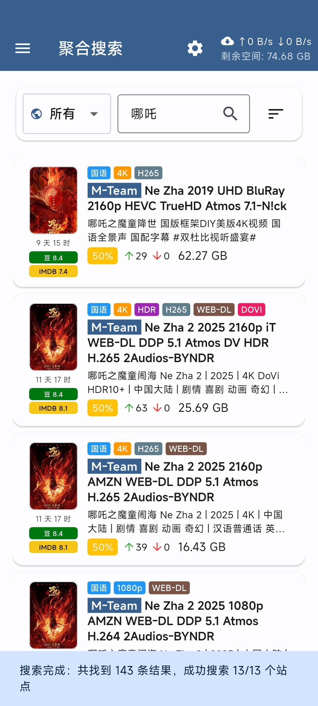
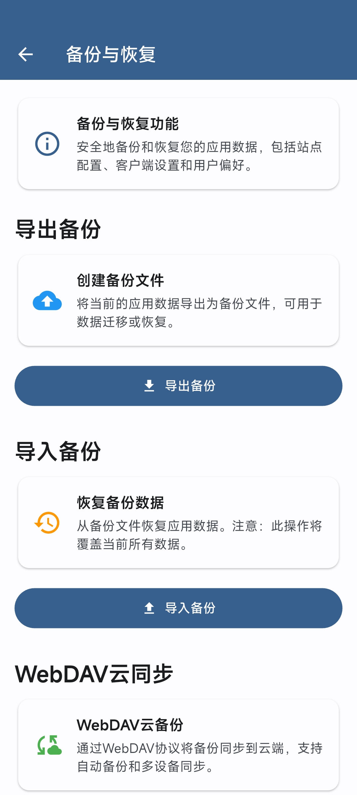

# PT Mate（PT伴侣）

基于 Flutter（Material Design 3）开发的私有种子站点客户端，支持多种PT站点的种子浏览、搜索和下载管理。目前支持M-Team和NexusPHP类型的站点。

## 功能特性

### 核心功能
- **种子浏览**：支持按分类（综合/电影/电视）浏览最新种子资源
- **种子收藏**：支持收藏种子，方便后续查看和管理
- **搜索功能**：关键词搜索，支持分类筛选
- **动态查询条件**：支持自定义搜索分类和查询参数，灵活配置搜索条件，相当于变相支持了高级搜索
- **种子详情**：查看种子详细信息、截图预览、文件列表
- **批量操作**：支持批量收藏和下载种子
- **下载管理**：集成 qBittorrent，支持一键下载到远程下载器
- **本地中转**：支持本地中转模式，先下载种子文件再提交给下载器

### 下载器集成
- **多下载器管理**：支持添加、编辑、删除多个 qBittorrent 实例
- **连接测试**：自动验证下载器连接状态
- **分类标签**：自动获取下载器的分类和标签配置
- **实时状态**：显示下载器的上传/下载速度和剩余空间

### 用户体验
- **Material Design 3**：现代化的界面设计
- **响应式布局**：适配不同屏幕尺寸
- **图片查看器**：支持缩放、平移的全屏图片浏览
- **安全存储**：敏感信息（Passkey、密码）安全加密存储
- **数据备份**：支持导出应用配置和数据到本地文件
- **数据恢复**：支持从备份文件导入配置和数据，快速恢复应用状态

### 截图





## 使用说明

### 动态查询条件配置

应用支持自定义搜索分类和查询参数，让您可以根据需要灵活配置搜索条件。

#### 配置步骤
1. 进入应用设置页面
2. 找到「搜索分类配置」部分
3. 可以点击获取让程序自动获取现有的分类信息
4. 也可以自定义：点击「添加分类」或编辑现有分类
5. 配置分类信息：
   - **显示名称**：在下拉框中显示的分类名称
   - **查询参数**：搜索时使用的参数配置

#### 参数格式

支持两种参数格式：

**推荐格式：JSON**
```json
{"mode":"normal","teams":["44","9","43"]}
```

**兼容格式：键值对（分号分隔）**
```
mode:"normal";teams:["44","9","43"]
```

#### 参数说明(m-team)
- `mode`：搜索模式（如 "normal"、"movie" 等）
- `teams`：制作组ID数组
- `categories`：分类ID数组 （数组格式，如：["407", "420"]）
- `discount`：促销（如 "FREE"、"PERCENT_50" 等）
- 其他自定义参数请自行在浏览器中的网络请求里面查找。

#### 特别注意
> pageNumber、pageSize、keyword、onlyFav 这几个参数不能自定义配置，因为这几个参数是动态设置用来分页以及查询的，自定义配置会导致查询结果及分页错误。

#### 使用示例

**电影分类配置**
```json
{"mode":"movie"}
```

**特定制作组配置**
```json
{"mode":"normal","teams":["44","9"]}
```

**免费筛选配置**
```json
{"mode":"normal","discount":"FREE"}
```

配置完成后，在主页面的分类下拉框中选择对应分类即可使用自定义的查询条件进行搜索。

### NexusPHP Web 类型站点使用说明

对于 NexusPHP Web 类型的站点，应用会弹出内置的登录界面供用户完成登录认证。

#### 登录流程
1. 选择 NexusPHP Web 类型站点后，应用会自动弹出登录界面
2. 在弹出的界面中输入用户名和密码完成登录
3. 登录成功后，应用会自动获取必要的 Cookie 信息
4. 正常情况下登录界面会自动关闭

#### 手动关闭登录界面
如果登录已完成但界面长时间没有自动关闭，您可以：
- 点击登录界面右上角的关闭按钮手动关闭
- 手动关闭不会影响 Cookie 的获取和保存
- 关闭后即可正常使用站点功能

## 项目结构

```
lib/
├── app.dart                        # 应用入口、路由配置
├── main.dart                       # 主函数
├── models/
│   └── app_models.dart             # 数据模型定义
├── pages/
│   ├── about_page.dart             # 关于页面
│   ├── backup_restore_page.dart    # 备份恢复页面
│   ├── downloader_settings_page.dart # 下载器设置页面
│   ├── server_settings_page.dart   # 服务器设置页面
│   ├── settings_page.dart          # 设置页面
│   └── torrent_detail_page.dart    # 种子详情页面
├── services/
│   ├── api/                        # API 服务
│   │   ├── api_client.dart         # PT站点 API 客户端
│   │   ├── mteam_adapter.dart      # M-Team 适配器
│   │   └── nexusphp_adapter.dart   # NexusPHP 适配器
│   ├── qbittorrent/                # qBittorrent 相关
│   │   ├── qb_client.dart          # qBittorrent API 封装
│   │   └── qb_models.dart          # qBittorrent 数据模型
│   ├── storage/                    # 存储服务
│   │   ├── storage_keys.dart       # 存储键定义
│   │   └── storage_service.dart    # 本地存储服务
│   ├── theme/                      # 主题服务
│   │   └── theme_service.dart      # 主题管理
│   ├── backup_service.dart         # 备份恢复服务
│   ├── image_http_client.dart      # 图片加载客户端
│   └── site_config_service.dart    # 站点配置服务
├── utils/
│   ├── backup_migrators.dart       # 备份数据迁移器
│   └── format.dart                 # 格式化工具函数
└── widgets/
    ├── app_drawer.dart             # 应用侧边栏
    ├── nexusphp_web_login.dart     # NexusPHP Web 登录组件
    ├── qb_speed_indicator.dart     # qBittorrent 速度指示器
    └── server_settings_back_button.dart # 服务器设置返回按钮
```

## 技术栈

- **Flutter**: 跨平台移动应用框架
- **Provider**: 状态管理
- **Dio**: HTTP 客户端
- **SharedPreferences**: 本地配置存储
- **FlutterSecureStorage**: 敏感信息安全存储
- **DeviceFrame**: 设备预览框架

## 快速开始

### 环境要求
- Flutter SDK 3.0+
- Dart SDK 3.0+
- Android Studio / VS Code

### 安装依赖
```bash
flutter pub get
```

### 运行应用
```bash
# 调试模式
flutter run

# 发布模式
flutter run --release
```

### 构建 APK
```bash
# 调试版本
flutter build apk --debug

# 发布版本
flutter build apk --release
```

## 配置说明

### 站点配置
- 支持多种PT站点类型（M-Team、NexusPHP）
- 支持自定义站点域名
- 使用 Passkey 进行身份验证
- 自动保存登录状态

### qBittorrent 配置
- 支持多个下载器实例
- 自动获取分类和标签
- 支持本地中转下载模式

## 安全性

- 所有敏感信息（Passkey、密码）使用 FlutterSecureStorage 加密存储
- 不在日志中记录敏感信息
- 支持 HTTPS 证书验证

## 许可证

MIT License - 详见 [LICENSE](LICENSE) 文件
