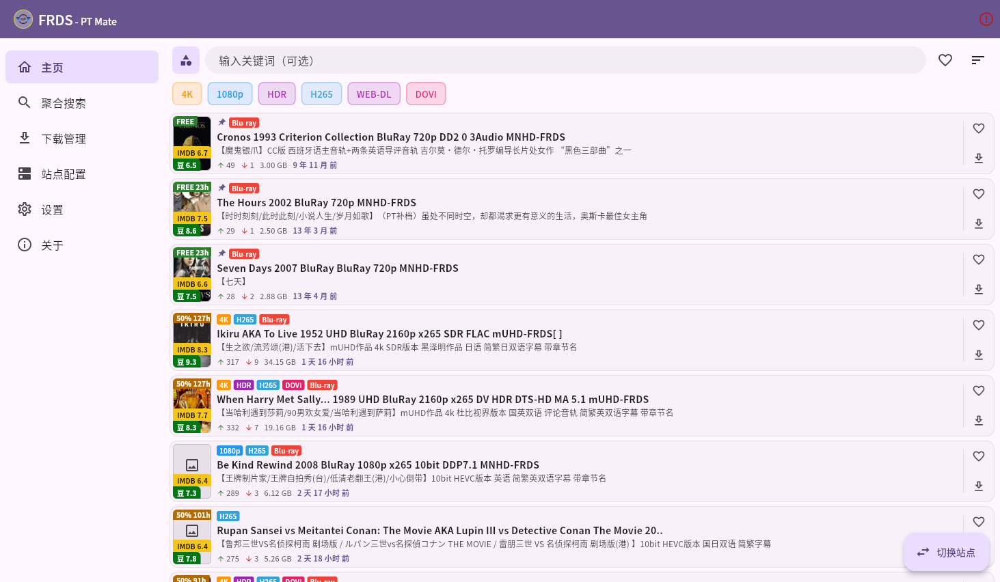
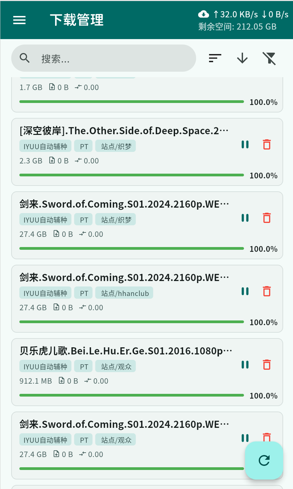

# PT Mate（PT伴侣）

[English](./README.md)

基于 Flutter（Material Design 3）开发的私有种子站点客户端，支持多种 PT 站点的种子浏览、搜索和下载管理。

📣 官方交流群（Telegram）：[加入 PT Mate 官方交流群](https://t.me/pt_mate)

## 功能概览

- 种子浏览、搜索、详情、收藏、批量操作
- 多网站聚合搜索
- 下载器集成（qBittorrent / Transmission）
- 本地中转下载
- 数据备份与恢复（含 WebDAV）

## 当前支持的网站类型

- `Gazelle`
- `M-Team`
- `NexusPHP`
- `NexusPHPWeb`
- `RousiPro`
- `Unit3D`

## 当前支持的网站

以下清单基于 `assets/sites/*.json`（共 37 个）：

- `Gazelle`（1）：DIC Music
- `M-Team`（1）：M-Team
- `NexusPHP`（13）：藏宝阁、天枢、自由农场、好学、垃圾堆、幸运、momentpt、PTFans、PT GTK、PTSKit、PTZone、肉丝、织梦
- `NexusPHPWeb`（20）：AFUN、末日、Audiences、比特校园、财神、FRDS、HDDolby、HDFans、麒麟、HHanClub、老师、OurBits、ptt、青蛙、SSD、TTG、U2Share、UBits、星陨阁、猪猪
- `RousiPro`（1）：肉丝Pro(beta)
- `Unit3D`（1）：MonikaDesign

## 截图预览

<p align="center">
  
  
  
</p>

## 快速开始

```bash
flutter pub get
flutter run
```

## iOS 侧载源

SideStore：
[添加 PT Mate Source](https://intradeus.github.io/http-protocol-redirector?r=sidestore://source?url=https://raw.githubusercontent.com/JustLookAtNow/pt_mate/refs/heads/master/altsource/AltSource.json)

直接源地址：

```text
https://raw.githubusercontent.com/JustLookAtNow/pt_mate/refs/heads/master/altsource/AltSource.json
```

## 文档

- [文档目录](./docs/README.md)
- [使用指南](./docs/USER_GUIDE.md)
- [开发指南](./docs/DEVELOPMENT_GUIDE.md)
- [网站配置指南](./docs/SITE_CONFIGURATION_GUIDE.md)
- [API 文档目录](./docs/api)

## 许可证

MIT License，详见 [LICENSE](./LICENSE)。

## Star 趋势

[](https://star-history.com/#JustLookAtNow/pt_mate&Date)
